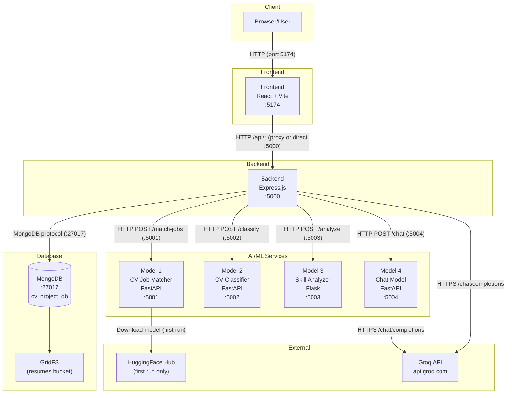

# PROJECT_ARCHITECTURE_AND_WORKFLOW.md

> **AI-Based CV Classification and Matching System**
> **Brand Name:** JobCompass
> **Generated:** August 12, 2026
> **Purpose:** Technical reference for Dockerization

---

## Table of Contents

1. [Complete Project Structure](#1-complete-project-structure)
2. [Runtime Service Inventory](#2-runtime-service-inventory)
3. [Frontend Architecture](#3-frontend-architecture)
4. [Backend Architecture](#4-backend-architecture)
5. [Database Architecture](#5-database-architecture)
6. [AI/ML Services Overview](#6-aiml-services-overview)
7. [Model 1: CV-Job Matcher](#7-model-1-cv-job-matcher)
8. [Model 2: CV Classifier](#8-model-2-cv-classifier)
9. [Model 3: Skill Analyzer](#9-model-3-skill-analyzer)
10. [Model 4: Chat Model](#10-model-4-chat-model)
11. [Runtime & Version Matrix](#11-runtime--version-matrix)
12. [Build Requirements](#12-build-requirements)
13. [Runtime Files](#13-runtime-files)
14. [Build Context & Ignore Analysis](#14-build-context--ignore-analysis)
15. [Environment Variables](#15-environment-variables)
16. [Port Map](#16-port-map)
17. [Service-to-Service Communication](#17-service-to-service-communication)
18. [Networking Analysis](#18-networking-analysis)
19. [Storage & Filesystem Analysis](#19-storage--filesystem-analysis)
20. [External Dependencies](#20-external-dependencies)
21. [Startup Order & Readiness](#21-startup-order--readiness)
22. [Health Checks & Readiness](#22-health-checks--readiness)
23. [Resource Requirements](#23-resource-requirements)
24. [Complete Application Workflows](#24-complete-application-workflows)
25. [Data Flow](#25-data-flow)
26. [Local Development Workflow](#26-local-development-workflow)
27. [Service Responsibility Table](#27-service-responsibility-table)
28. [Dependency Graph](#28-dependency-graph)

---

## 1. Complete Project Structure

```
E:\CV\
├── .env.example                          # Root environment template
├── package.json                          # Monorepo root (npm workspaces)
├── README.md
├── START.bat                             # Quick start (frontend only)
├── START_LOCAL.bat                       # Full local startup (all services)
├── START_LOCAL.ps1                       # Full local startup (PowerShell)
├── RUN.ps1                               # Backend + Frontend startup
├── start_all_models.py                   # Python: start all 4 ML models
├── start_all_services.ps1                # PowerShell: all services
├── start_classifier.ps1                  # PowerShell: classifier only
├── start_cv_classifier.ps1               # PowerShell: CV classifier
├── start_skill_analyzer.ps1              # PowerShell: skill analyzer
├── start_skill_matcher.ps1               # PowerShell: skill matcher
├── start_skill_matcher.py                # Python: skill matcher
│
├── Backend/                              # Node.js Express API
│   ├── .env                              # Environment variables (actual)
│   ├── .env.example                      # Environment template
│   ├── .gitignore
│   ├── package.json                      # Backend dependencies
│   ├── nodemon.json                      # Nodemon config
│   ├── server.js                         # Entry point
│   ├── config/
│   │   ├── database.js                   # MongoDB connection
│   │   └── gridfs.js                     # GridFS file storage init
│   ├── controllers/
│   │   ├── authController.js             # Auth (register, login, profile)
│   │   ├── candidateController.js        # Candidate CRUD, CV upload
│   │   ├── companyController.js          # Company profile CRUD
│   │   ├── jobController.js              # Job CRUD, apply, match scores
│   │   ├── mlController.js               # ML service orchestration
│   │   ├── notificationController.js     # Notifications CRUD
│   │   └── analyticsController.js        # Dashboard analytics
│   ├── middleware/
│   │   ├── authMiddleware.js             # JWT verification
│   │   ├── errorMiddleware.js            # Global error handler
│   │   ├── roleMiddleware.js             # Role-based access
│   │   └── validationMiddleware.js       # Request validation
│   ├── models/
│   │   ├── Analytics.js                  # Analytics schema
│   │   ├── Candidate.js                  # Candidate/CV schema
│   │   ├── Company.js                    # Company profile schema
│   │   ├── Job.js                        # Job posting schema
│   │   ├── Notification.js               # Notification schema
│   │   └── User.js                       # User auth schema
│   ├── routes/
│   │   ├── authRoutes.js                 # /api/auth/*
│   │   ├── candidateRoutes.js            # /api/candidates/*
│   │   ├── companyRoutes.js              # /api/company/*
│   │   ├── jobRoutes.js                  # /api/jobs/*
│   │   ├── mlRoutes.js                   # /api/ml/*
│   │   ├── notificationRoutes.js         # /api/notifications/*
│   │   ├── analyticsRoutes.js            # /api/analytics/*
│   │   └── resumeRoutes.js               # /api/resumes/*
│   ├── utils/
│   │   ├── hybridMatcher.js              # JS skill-based matching engine
│   │   └── pythonMatcher.js              # Persistent Python subprocess manager
│   └── scripts/                          # Utility/test scripts
│
├── Frontend/                             # React SPA
│   ├── .gitignore
│   ├── package.json                      # Frontend dependencies
│   ├── index.html                        # SPA entry HTML
│   ├── vite.config.js                    # Vite config (port 5174, proxy)
│   ├── tailwind.config.cjs               # Tailwind config
│   ├── postcss.config.cjs                # PostCSS config
│   ├── tsconfig.json / tsconfig.app.json / tsconfig.node.json
│   ├── eslint.config.js
│   └── src/
│       ├── main.jsx                      # React entry point
│       ├── App.jsx                       # Router + route definitions
│       ├── index.css                     # Global styles
│       ├── components/
│       │   ├── Navbar.jsx                # Landing page navbar
│       │   ├── TopNavbar.jsx             # Authenticated navbar
│       │   ├── HRLayout.jsx              # HR sidebar layout
│       │   ├── PageTransition.jsx        # Page transition wrapper
│       │   ├── Footer.jsx
│       │   ├── HeroSection.jsx
│       │   ├── FeatureSection.jsx
│       │   ├── UploadCV.jsx              # CV upload widget
│       │   ├── Toast.jsx                 # Toast notifications
│       │   └── ... (other UI components)
│       ├── pages/
│       │   ├── Home.jsx                  # Landing page
│       │   ├── Login.jsx                 # Login page
│       │   ├── Register.jsx              # Registration page
│       │   ├── Dashboard.jsx             # Employee dashboard
│       │   ├── Profile.jsx               # Employee profile + CV upload
│       │   ├── Jobs.jsx                  # Job listings
│       │   ├── JobDetails.jsx            # Job detail view
│       │   ├── Interview.jsx             # AI Career Assistant chatbot
│       │   ├── HRDashboard.jsx           # HR dashboard
│       │   ├── HRProfile.jsx             # HR profile
│       │   ├── MatchedCandidates.jsx     # HR: matched CVs for a job
│       │   ├── AllJobsMatching.jsx       # HR: all jobs with match scores
│       │   ├── JobApplicants.jsx         # HR: job applicants
│       │   ├── CandidateProfile.jsx      # HR: candidate detail
│       │   ├── HRMessages.jsx            # HR messages
│       │   ├── HRCompanyProfile.jsx      # HR company profile
│       │   ├── HRApplicants.jsx          # HR applicant list
│       │   ├── HRSchedule.jsx            # HR schedule
│       │   ├── HRSettings.jsx            # HR settings
│       │   └── HRHelpCenter.jsx          # HR help center
│       ├── context/
│       │   └── ThemeContext.jsx           # Dark/light theme
│       ├── hooks/
│       │   ├── useScrollReveal.js
│       │   └── useScrollReveal.jsx
│       └── utils/
│           └── api.js                    # Centralized API client
│
├── model-1-cv-matcher/                   # Python: CV-Job Matching
│   ├── cv_job_matcher.py                 # FastAPI entry point
│   ├── requirements.txt
│   ├── test_model.py
│   └── test_model_fallback.py
│
├── model-2-cv-classifier/                # Python: CV Classification
│   ├── cv_classifier.py                  # FastAPI entry point
│   ├── requirements.txt
│   └── test_model.py
│
├── model-3-skill-analyzer/               # Python: Skill Analysis
│   ├── skill_analyzer.py                 # Flask entry point
│   ├── requirements.txt
│   └── test_model.py
│
└── model-4-chat-model/                   # Python: Career Chat
    ├── chat_model.py                     # FastAPI entry point
    └── requirements.txt
```

---

## 2. Runtime Service Inventory

| # | Service | Directory | Purpose | Language | Framework | Runtime | Port | Can Run Independently |
|---|---------|-----------|---------|----------|-----------|---------|------|-----------------------|
| 1 | **Frontend** | `Frontend/` | SPA web client | JavaScript (JSX) | React 19 + Vite (rolldown-vite) | Node.js | 5174 | Yes (needs Backend for data) |
| 2 | **Backend** | `Backend/` | REST API server | JavaScript (ESM) | Express 5 | Node.js | 5000 | No (needs MongoDB) |
| 3 | **Model 1** | `model-1-cv-matcher/` | CV-Job matching (BERT/TF-IDF) | Python | FastAPI + uvicorn | Python | 5001 | Yes |
| 4 | **Model 2** | `model-2-cv-classifier/` | CV job title classification | Python | FastAPI + uvicorn | Python | 5002 | Yes |
| 5 | **Model 3** | `model-3-skill-analyzer/` | CV-Job skill gap analysis | Python | Flask | Python | 5003 | Yes |
| 6 | **Model 4** | `model-4-chat-model/` | Career assistant chatbot | Python | FastAPI + uvicorn | Python | 5004 | Yes |
| 7 | **MongoDB** | (external) | Document database | — | — | mongod | 27017 | Yes |

---

## 3. Frontend Architecture

### Overview
- **Framework:** React 19.1.1
- **Language:** JavaScript (JSX), TypeScript config present but not used for source files
- **Runtime:** Node.js (development only; production is static files)
- **Package Manager:** npm
- **Bundler:** Vite (via `rolldown-vite@7.1.14` override)
- **CSS:** Tailwind CSS 4.1.16 + PostCSS
- **Routing:** react-router-dom 7.9.5
- **HTTP Client:** axios 1.13.2 + native fetch
- **Charts:** recharts 3.5.1

### Entry Point
- **HTML:** `Frontend/index.html`
- **JS:** `Frontend/src/main.jsx` → renders `<App />`
- **Router:** `Frontend/src/App.jsx` (BrowserRouter with all routes)

### Development Server
- **Command:** `npm run dev` (runs `vite`)
- **Port:** `5174` (configured in `vite.config.js`)
- **HMR:** Enabled, overlay disabled
- **Proxy:** `/api` → `http://localhost:5000` (Vite dev proxy)

### Production Build
- **Command:** `npm run build` (runs `vite build`)
- **Output:** `Frontend/dist/`
- **Production serving:** Backend serves `Frontend/dist/` as static files when `NODE_ENV=production`

### API Communication
- **Base URL:** `import.meta.env.VITE_API_BASE_URL || ''` (empty string = same-origin via Vite proxy in dev)
- **File:** `Frontend/src/utils/api.js` — centralized API utility
- **Auth:** JWT Bearer token stored in `localStorage`, attached via `Authorization` header
- **File uploads:** FormData with multipart/form-data

### Key Routes
| Route | Component | Auth Required | Role |
|-------|-----------|---------------|------|
| `/` | Home (Navbar + Landing) | No | — |
| `/login` | Login | No | — |
| `/register` | Register | No | — |
| `/employee/dashboard` | Dashboard | Yes | employee, user |
| `/employee/profile` | Profile (CV upload) | Yes | employee, user |
| `/employee/jobs` | Job listings | Yes | employee, user |
| `/employee/jobs/:jobId` | Job details | Yes | employee, user |
| `/employee/interview` | AI Career Assistant | Yes | employee, user |
| `/hr/dashboard` | HR Dashboard | Yes | hr |
| `/hr/jobs` | HR Job management | Yes | hr |
| `/hr/matched-candidates` | Matched CVs | Yes | hr |
| `/hr/all-jobs-matching` | All jobs matching | Yes | hr |
| `/hr/profile` | HR Profile | Yes | hr |
| `/hr/jobs/:jobId/applicants` | Job applicants | Yes | hr |
| `/hr/candidates/:candidateId` | Candidate profile | Yes | hr |
| `/hr/messages` | HR Messages | Yes | hr |

### Environment Variables (Frontend)
| Variable | Source | Purpose |
|----------|--------|---------|
| `VITE_API_BASE_URL` | `.env` or `vite.config.js` | API base URL (default: `''`) |

---

## 4. Backend Architecture

### Overview
- **Framework:** Express 5.1.0
- **Language:** JavaScript (ES Modules)
- **Runtime:** Node.js
- **Package Manager:** npm
- **Entry Point:** `Backend/server.js`
- **Module System:** ES Modules (`"type": "module"` in package.json)

### Startup
- **Development:** `npm run dev` → `nodemon server.js`
- **Production:** `npm start` → `node server.js`
- **Port:** `process.env.PORT || 5000`
- **Body limit:** 10MB JSON, 10MB URL-encoded
- **Server timeout:** 120,000ms (for ML operations)

### Dependencies
| Package | Version | Purpose |
|---------|---------|---------|
| express | ^5.1.0 | HTTP framework |
| mongoose | ^8.19.1 | MongoDB ODM |
| cors | ^2.8.5 | CORS middleware |
| cookie-parser | ^1.4.7 | Cookie parsing |
| dotenv | ^17.2.3 | Environment variables |
| jsonwebtoken | ^9.0.2 | JWT authentication |
| bcryptjs | ^3.0.2 | Password hashing |
| bcrypt | ^6.0.0 | Password hashing (alternative) |
| axios | ^1.7.7 | HTTP client (ML service calls) |
| multer | ^1.4.5-lts.1 | File upload (memory storage) |
| pdf-parse | ^1.1.1 | PDF text extraction |
| express-validator | ^7.2.1 | Request validation |
| form-data | ^4.0.5 | Form data handling |
| nodemon | ^3.1.10 | Dev auto-restart |

### API Routes
| Route Prefix | File | Purpose |
|-------------|------|---------|
| `/api/auth` | authRoutes.js | Register, login, profile, user management |
| `/api/jobs` | jobRoutes.js | CRUD jobs, apply, applicants, saved jobs |
| `/api/candidates` | candidateRoutes.js | CRUD candidates, CV upload, apply, match |
| `/api/company` | companyRoutes.js | Company profile CRUD |
| `/api/analytics` | analyticsRoutes.js | Dashboard analytics |
| `/api/notifications` | notificationRoutes.js | Notifications CRUD |
| `/api/resumes` | resumeRoutes.js | GridFS resume download |
| `/api/ml` | mlRoutes.js | ML service orchestration |

### Key API Endpoints

#### Authentication (`/api/auth`)
| Method | Endpoint | Auth | Role | Description |
|--------|----------|------|------|-------------|
| POST | `/register` | No | — | Register user (hr/employee/user) |
| POST | `/login` | No | — | Login, returns JWT |
| GET | `/me` | Yes | Any | Get own profile |
| PUT | `/me` | Yes | Any | Update own profile |
| POST | `/me/upload-image` | Yes | Any | Upload profile image (base64) |
| PATCH | `/me/password` | Yes | Any | Change password |
| DELETE | `/me` | Yes | Any | Delete own account |
| GET | `/users` | Yes | hr | Get all users |
| GET | `/users/:id` | Yes | hr | Get user by ID |
| PUT | `/users/:id` | Yes | hr | Update user |
| DELETE | `/users/:id` | Yes | hr | Delete user |

#### Jobs (`/api/jobs`)
| Method | Endpoint | Auth | Role | Description |
|--------|----------|------|------|-------------|
| GET | `/latest` | No | — | Get 3 latest active jobs |
| GET | `/` | Yes | Any | Get all jobs (HR: own; Employee: active + match scores) |
| POST | `/` | Yes | hr | Create job (with optional logo upload) |
| GET | `/search` | Yes | hr | Search jobs |
| GET | `/:id` | Yes | Any | Get job details |
| PUT | `/:id` | Yes | hr | Update job |
| DELETE | `/:id` | Yes | hr | Delete job |
| POST | `/:id/apply` | Yes | employee/user | Apply to job |
| DELETE | `/:id/withdraw` | Yes | employee/user | Withdraw application |
| GET | `/:id/applicants` | Yes | hr | Get job applicants |
| GET | `/hr/saved-jobs` | Yes | hr | Get HR saved jobs |
| POST | `/hr/saved-jobs/:jobId` | Yes | hr | Toggle save job |

#### Candidates (`/api/candidates`)
| Method | Endpoint | Auth | Role | Description |
|--------|----------|------|------|-------------|
| GET | `/` | Yes | hr | Get all candidates |
| POST | `/` | Yes | Any | Create candidate |
| GET | `/me` | Yes | Any | Get own candidate profile |
| GET | `/search` | Yes | hr | Search candidates |
| POST | `/apply` | Yes | Any | Apply for job |
| PUT | `/application/status` | Yes | hr | Update application status |
| POST | `/match` | Yes | hr | Calculate match |
| POST | `/upload` | Yes | employee | Upload CV (PDF → GridFS + text extraction + auto-classify) |
| GET | `/:id` | Yes | Any | Get candidate |
| PUT | `/:id` | Yes | Any | Update candidate |
| DELETE | `/:id` | Yes | Any | Delete candidate |
| GET | `/:id/resume` | Yes | Any | Download resume from GridFS |
| GET | `/saved-jobs` | Yes | employee | Get saved jobs |
| POST | `/saved-jobs/:jobId` | Yes | employee | Toggle save job |

#### ML Orchestration (`/api/ml`)
| Method | Endpoint | Auth | Role | Description |
|--------|----------|------|------|-------------|
| POST | `/match` | No | — | Match CV file (currently disabled - 501) |
| POST | `/chat` | Yes | Any | AI career chatbot |
| GET | `/match-jobs` | Yes | Any | Match jobs for user's CV |
| POST | `/match-jobs` | Yes | Any | Match jobs for user's CV |
| GET | `/analyze-job/:jobId` | Yes | Any | Analyze job skills for user |
| POST | `/match-cvs` | Yes | hr | Match CVs to a job description |
| GET | `/match-inputs` | No | — | Debug: view matcher inputs |
| POST | `/classify-cv` | Yes | Any | Classify CV job title |

### Authentication Flow
1. User registers with email, password, name, role (hr/employee/user)
2. Password hashed with bcryptjs (salt rounds: 10)
3. JWT token issued (expires: 7d), signed with `JWT_SECRET`
4. Subsequent requests include `Authorization: Bearer <token>` header
5. `verifyToken` middleware decodes JWT, fetches user from DB, attaches to `req.user`
6. `authorizeRoles('hr')` middleware checks `req.user.role`
7. Optional: `SKIP_AUTH=true` bypasses auth entirely for development

### Middleware Stack (in order)
1. `cors()` — Cross-origin requests
2. `express.json({ limit: "10mb" })` — JSON body parsing
3. `express.urlencoded({ extended: true, limit: "10mb" })` — URL-encoded body parsing
4. `cookieParser()` — Cookie parsing
5. Route-specific: `protect` (JWT), `authorizeRoles` (RBAC), `validate` (express-validator)

---

## 5. Database Architecture

### Database
- **Type:** MongoDB (document database)
- **Driver/ODM:** Mongoose 8.19.1
- **Default URI:** `mongodb://localhost:27017/cv_project_db`
- **Connection:** `Backend/config/database.js`
- **GridFS:** Used for resume/PDF file storage (bucket: `resumes`)

### Models/Collections

#### User (`cv-users` collection)
| Field | Type | Notes |
|-------|------|-------|
| name | String | Required |
| email | String | Required, unique, lowercase |
| password | String | Required, hashed, select: false |
| role | String | enum: user, hr, employee |
| avatar | String | Base64 or URL |
| profileImage | String | Base64 data URI |
| phone | String | |
| savedJobs | [ObjectId ref Job] | HR bookmarked jobs |
| createdAt | Date | timestamps |
| updatedAt | Date | timestamps |

#### Candidate
| Field | Type | Notes |
|-------|------|-------|
| name | String | Required |
| email | String | Required, unique, lowercase |
| phone | String | |
| photo | String | |
| university | String | |
| degree | String | |
| skills | [String] | |
| experience | Number | Years |
| experienceLevel | String | Entry Level/Mid Level/Senior Level/Executive |
| resumeUrl | String | GridFS file ID |
| resumeText | String | Extracted CV text |
| jobTitle | String | Classified job title |
| classificationResult | Object | { jobTitle, confidence, method, classifiedAt } |
| extractedSkills | [String] | |
| savedJobs | [ObjectId ref Job] | Employee bookmarked jobs |
| linkedinUrl | String | |
| portfolioUrl | String | |
| applications | [Object] | { jobId, appliedAt, status, matchPercentage, answers } |
| location | String | |
| availability | String | Immediate/2 Weeks/1 Month/Not Available |
| timestamps | | |

#### Job
| Field | Type | Notes |
|-------|------|-------|
| title | String | Required |
| description | String | Required |
| department | String | Required |
| requiredSkills | [String] | Required |
| experienceLevel | String | Required |
| salary | Object | { min, max, currency } |
| location | String | Required |
| jobType | String | Full-time/Part-time/Contract/Remote |
| status | String | Active/Closed/Draft |
| applicantsCount | Number | |
| postedBy | ObjectId ref User | Required |
| company | String | |
| companyLogo | String | Base64 data URI |
| companyId | ObjectId ref Company | |
| applicationQuestions | [String] | |
| timestamps | | |

#### Company
| Field | Type | Notes |
|-------|------|-------|
| name | String | Required |
| logo | String | |
| industry | String | Required |
| description | String | |
| website | String | |
| location | String | Required |
| size | String | enum |
| founded | Number | |
| ownerId | ObjectId ref User | Required |
| socialMedia | Object | { linkedin, twitter, facebook } |
| timestamps | | |

#### Notification
| Field | Type | Notes |
|-------|------|-------|
| userId | ObjectId ref User | Required |
| title | String | Required |
| message | String | Required |
| type | String | application/interview/system/message |
| read | Boolean | Default: false |
| link | String | |
| jobId | ObjectId ref Job | |
| applicantId | ObjectId ref User | |
| timestamps | | |

#### Analytics
| Field | Type | Notes |
|-------|------|-------|
| userId | ObjectId ref User | Required |
| date | Date | |
| metrics | Object | { totalJobs, totalCandidates, totalApplications, avgMatchRate, ... } |
| applicationsOverTime | [{ date, count }] | |
| topSkills | [{ skill, count }] | |
| matchRateDistribution | [{ range, count }] | |
| timestamps | | |

### GridFS Storage
- **Bucket name:** `resumes`
- **Collections:** `resumes.files`, `resumes.chunks`
- **Used for:** PDF resume storage
- **Init:** `Backend/config/gridfs.js` — initialized after MongoDB connection
- **Write:** `candidateController.js` — `uploadResume` function
- **Read:** `candidateController.js` — `downloadResume` function + `resumeRoutes.js`

---

## 6. AI/ML Services Overview

| Model | Port | Framework | Purpose | External API | Heavy Dependencies |
|-------|------|-----------|---------|-------------|-------------------|
| Model 1: CV-Job Matcher | 5001 | FastAPI | Match CVs to jobs using BERT/TF-IDF | None | sentence-transformers, torch, scikit-learn |
| Model 2: CV Classifier | 5002 | FastAPI | Classify CV into job categories | None | None (keyword-based) |
| Model 3: Skill Analyzer | 5003 | Flask | Analyze CV-Job skill gaps | None | None (keyword-based) |
| Model 4: Chat Model | 5004 | FastAPI | Career assistant chatbot | Groq API (optional) | groq library (optional) |

---

## 7. Model 1: CV-Job Matcher

### Overview
- **Directory:** `model-1-cv-matcher/`
- **Language:** Python
- **Framework:** FastAPI + uvicorn
- **Entry Point:** `cv_job_matcher.py`
- **Port:** 5001
- **Host:** `0.0.0.0`

### Dependencies (`requirements.txt`)
```
fastapi==0.115.5
uvicorn[standard]==0.32.0
pydantic>=2.0.0
numpy
scikit-learn
sentence-transformers>=2.2.0
torch>=2.0.0
```

### Startup Behavior
1. On startup, loads SentenceTransformer model `all-MiniLM-L6-v2` from local cache (`bert-cache/` directory)
2. If BERT model unavailable, falls back to TF-IDF (scikit-learn)
3. Model weights are loaded into memory at startup (may take 30-60 seconds for BERT)

### API Endpoints
| Method | Endpoint | Request | Response | Description |
|--------|----------|---------|----------|-------------|
| POST | `/match-jobs` | `{ cv_text, job_descriptions, top_k }` | `{ success, matches: [{ job_index, similarity_score }], method }` | Match CV against job descriptions |
| GET | `/health` | — | `{ status, model, service }` | Health check |
| GET | `/` | — | Service info | Root endpoint |

### Processing Pipeline
1. Receive CV text + list of job descriptions
2. Encode CV text using BERT or TF-IDF
3. Encode each job description
4. Calculate cosine similarity (semantic) + keyword match score
5. Final score = 50% semantic + 50% keyword
6. Return top-k matches sorted by score

### Who Calls It
- Backend `mlController.js` → `matchJobs()` — POST `/match-jobs` (with 60s timeout)
- Backend `pythonMatcher.js` — spawns as persistent subprocess for in-process matching

### Model Artifacts
- `bert-cache/` directory (downloaded at first startup, contains `all-MiniLM-L6-v2` model)
- No other model files

---

## 8. Model 2: CV Classifier

### Overview
- **Directory:** `model-2-cv-classifier/`
- **Language:** Python
- **Framework:** FastAPI + uvicorn
- **Entry Point:** `cv_classifier.py`
- **Port:** 5002
- **Host:** `0.0.0.0`

### Dependencies (`requirements.txt`)
```
fastapi==0.115.5
uvicorn[standard]==0.32.0
pydantic>=2.0.0
```

### Startup Behavior
- Lightweight startup, no model loading
- Uses keyword matching against predefined job categories
- 20 job categories defined with associated keywords

### API Endpoints
| Method | Endpoint | Request | Response | Description |
|--------|----------|---------|----------|-------------|
| POST | `/classify` | `{ cv_text, use_groq_analysis }` | `{ success, job_title, confidence, decision_method, top_5_predictions }` | Classify CV into job category |
| GET | `/health` | — | `{ status, categories, service }` | Health check |
| GET | `/` | — | Service info + categories | Root endpoint |

### Job Categories (20)
Software Engineer, Frontend Developer, Backend Developer, Full Stack Developer, Data Scientist, Machine Learning Engineer, DevOps Engineer, Mobile Developer, UI/UX Designer, QA Engineer, Cloud Engineer, Cybersecurity Engineer, Project Manager, Database Administrator, Accountant, HR Manager, Marketing Manager, Sales Representative, Healthcare Professional, Teacher

### Who Calls It
- Backend `mlController.js` → `classifyCV()` — POST `/classify` (30s timeout)
- Backend `candidateController.js` → `uploadResume()` — auto-classifies on CV upload (30s timeout)

---

## 9. Model 3: Skill Analyzer

### Overview
- **Directory:** `model-3-skill-analyzer/`
- **Language:** Python
- **Framework:** Flask + flask-cors
- **Entry Point:** `skill_analyzer.py`
- **Port:** 5003
- **Host:** `0.0.0.0`

### Dependencies (`requirements.txt`)
```
flask>=3.0.0
flask-cors>=4.0.0
```

### Startup Behavior
- Lightweight startup, no model loading
- Loads comprehensive skills database (14 categories, 200+ skills)
- Pure keyword-based analysis

### API Endpoints
| Method | Endpoint | Request | Response | Description |
|--------|----------|---------|----------|-------------|
| POST | `/analyze` | `{ cv_text, job_desc }` | `{ success, data: { cv_skills, job_skills, missing_skills, matched_skills, match_percentage } }` | Analyze CV-Job skill match |
| GET | `/health` | — | `{ success, message, skills_count, service }` | Health check |
| GET | `/` | — | Service info | Root endpoint |

### Processing Pipeline
1. Extract skills from CV text using keyword matching
2. Extract skills from job description using keyword matching
3. Find missing skills (in job but not in CV)
4. Prioritize missing skills (HIGH/MEDIUM/LOW)
5. Generate YouTube tutorial links for missing skills
6. Calculate match percentage

### Who Calls It
- Backend `mlController.js` → `analyzeJobForUser()` — POST `/analyze` (30s timeout)

---

## 10. Model 4: Chat Model

### Overview
- **Directory:** `model-4-chat-model/`
- **Language:** Python
- **Framework:** FastAPI + uvicorn
- **Entry Point:** `chat_model.py`
- **Port:** 5004
- **Host:** `0.0.0.0`

### Dependencies (`requirements.txt`)
```
fastapi==0.115.5
uvicorn[standard]==0.32.0
pydantic>=2.0.0
groq>=0.4.0
```

### External AI Provider
- **Provider:** Groq (https://api.groq.com)
- **Model:** `llama-3.3-70b-versatile`
- **Purpose:** Career assistant chatbot responses
- **Authentication:** `GROQ_API_KEY` environment variable
- **Fallback:** Local keyword-based responses when API unavailable

### Startup Behavior
1. Attempts to initialize Groq client with `GROQ_API_KEY`
2. If no API key or import error, falls back to local responses
3. No model weights loaded locally

### API Endpoints
| Method | Endpoint | Request | Response | Description |
|--------|----------|---------|----------|-------------|
| POST | `/chat` | `{ question, context }` | `{ success, answer, source }` | Chat with career assistant |
| GET | `/health` | — | `{ status, groq_api, service }` | Health check |
| GET | `/` | — | Service info | Root endpoint |

### Who Calls It
- Backend `mlController.js` → `chatModel()` — can call Model 4 OR directly use Groq API (if `GROQ_API_KEY` set in backend)

### Dual Chat Path (Backend)
The backend chat endpoint (`/api/ml/chat`) has two paths:
1. **If `GROQ_API_KEY` is set in Backend .env:** Backend calls Groq API directly (bypasses Model 4)
2. **If no key:** Backend proxies to Model 4 service at `CHAT_MODEL_URL`
3. **Final fallback:** Returns static career advice message

---

## 11. Runtime & Version Matrix

| Service | Language | Runtime | Version | Package Manager | Framework |
|---------|----------|---------|---------|-----------------|-----------|
| Frontend | JavaScript (JSX) | Node.js | Not pinned (18+ expected) | npm | React 19.1.1 + Vite (rolldown-vite 7.1.14) |
| Backend | JavaScript (ESM) | Node.js | Not pinned (18+ expected) | npm | Express 5.1.0 |
| Model 1 | Python | CPython | 3.9+ (torch requirement) | pip | FastAPI 0.115.5 + uvicorn 0.32.0 |
| Model 2 | Python | CPython | 3.9+ | pip | FastAPI 0.115.5 + uvicorn 0.32.0 |
| Model 3 | Python | CPython | 3.9+ | pip | Flask 3.0+ |
| Model 4 | Python | CPython | 3.9+ | pip | FastAPI 0.115.5 + uvicorn 0.32.0 |
| MongoDB | — | mongod | 6.0+ (Mongoose 8.x compatible) | — | — |

### Key Version Notes
- **Node.js:** No `.nvmrc` or `engines` field. Express 5 requires Node 18+.
- **Python:** No `.python-version` file. torch requires Python 3.9+.
- **npm workspaces:** Root `package.json` defines `"workspaces": ["Backend", "Frontend"]`
- **Vite override:** Frontend uses `"vite": "npm:rolldown-vite@7.1.14"` (Rolldown-based Vite)

---

## 12. Build Requirements

### Frontend
| Aspect | Details |
|--------|---------|
| Requires build step? | Yes (for production) |
| Build command | `npm run build` (runs `vite build`) |
| Build output | `Frontend/dist/` |
| Build dependencies | All `devDependencies` (vite, tailwind, postcss, etc.) |
| Runtime dependencies | Only `dependencies` section (react, react-dom, react-router-dom, axios, recharts) |
| Can separate build from runtime? | Yes — multi-stage Docker build possible |
| Runs from source in dev? | Yes (`npm run dev` → vite dev server) |

### Backend
| Aspect | Details |
|--------|---------|
| Requires build step? | No |
| Build command | N/A (runs from source) |
| Runtime files | All `.js` source files in Backend/ |
| Dependencies | All `dependencies` section |
| Can separate build from runtime? | N/A — no compilation needed |

### Model 1 (CV-Job Matcher)
| Aspect | Details |
|--------|---------|
| Requires build step? | No (but model download on first run) |
| Model download | `all-MiniLM-L6-v2` downloaded to `bert-cache/` on first startup |
| Model size | ~90MB (all-MiniLM-L6-v2) |
| Dependencies | torch (~2GB), sentence-transformers, scikit-learn, numpy |
| Can separate? | torch is the heavy dependency |

### Model 2 (CV Classifier)
| Aspect | Details |
|--------|---------|
| Requires build step? | No |
| Model artifacts | None (keyword-based) |
| Dependencies | Minimal (fastapi, uvicorn, pydantic) |

### Model 3 (Skill Analyzer)
| Aspect | Details |
|--------|---------|
| Requires build step? | No |
| Model artifacts | None (keyword-based) |
| Dependencies | Minimal (flask, flask-cors) |

### Model 4 (Chat Model)
| Aspect | Details |
|--------|---------|
| Requires build step? | No |
| Model artifacts | None (API-based) |
| Dependencies | fastapi, uvicorn, pydantic, groq |

---

## 13. Runtime Files

### Frontend Runtime Files
- `Frontend/dist/` — production build output
- `Frontend/index.html` — SPA entry (dev)
- `Frontend/src/` — all source files (dev)
- `Frontend/vite.config.js` — Vite configuration
- `Frontend/tailwind.config.cjs` — Tailwind configuration
- `Frontend/postcss.config.cjs` — PostCSS configuration

### Backend Runtime Files
- `Backend/server.js` — entry point
- `Backend/config/database.js` — DB connection
- `Backend/config/gridfs.js` — GridFS setup
- `Backend/controllers/*.js` — all controllers
- `Backend/middleware/*.js` — all middleware
- `Backend/models/*.js` — all Mongoose models
- `Backend/routes/*.js` — all route definitions
- `Backend/utils/*.js` — utility functions
- `Backend/.env` — environment variables
- `Backend/package.json` — dependencies
- `Backend/node_modules/` — installed packages

### Model Runtime Files
- Each model directory: `*.py` (source), `requirements.txt`
- Model 1 additionally: `bert-cache/` (downloaded model weights)

---

## 14. Build Context & Ignore Analysis

### Files/Directories NOT needed for Docker build context:

**Root level:**
- `*.ps1`, `*.bat` — Windows startup scripts
- `scripts/` — utility scripts
- `ask/` — Jupyter notebooks
- `MYYYYY/` — unrelated directory
- `inspect_model.py`, `inspect_vectorizer.py` — debug scripts
- `*.md` — documentation files
- `download_jobest-landing-page.psd` — design file
- `package.json` (root) — monorepo config (not needed in individual containers)
- `.git/`, `.gitignore`

**Backend:**
- `Backend/scripts/` — test/utility scripts
- `Backend/testDB.js`, `Backend/test_endpoints.js` — test files
- `Backend/deleteUser.js`, `Backend/clearAllUsers.js` — utility scripts
- `Backend/nodemon.json` — dev-only config
- `Backend/.env.example` — template

**Frontend:**
- `Frontend/node_modules/` — installed packages
- `Frontend/.gitignore`
- `Frontend/eslint.config.js` — linting config
- `Frontend/tsconfig*.json` — TypeScript config (not actively used)
- `Frontend/README.md`
- `Frontend/SCROLL_ANIMATIONS.md`
- `Frontend/lib/` — animate-ui components (may be needed by source)

**Models:**
- `model-*/test_model*.py` — test files
- `model-1-cv-matcher/bert-cache/` — should be in .dockerignore (downloaded at runtime)

### Special attention:
- `node_modules/` must be excluded (will be reinstalled in container)
- `bert-cache/` for Model 1 is large (~90MB) — consider pre-downloading or downloading at build time
- `.env` files must NOT be included in build context (use Docker secrets or env vars)

---

## 15. Environment Variables

### Complete Environment Variable Map

| Variable | Service | Purpose | Required | Default | Secret |
|----------|---------|---------|----------|---------|--------|
| `MONGO_URI` / `MONGODB_URI` | Backend | MongoDB connection string | Yes | `mongodb://localhost:27017/cv_project_db` | No |
| `JWT_SECRET` | Backend | JWT signing secret | Yes | None (warns if missing) | **Yes** |
| `PORT` | Backend | Server port | No | `5000` | No |
| `NODE_ENV` | Backend | Environment mode | No | `development` | No |
| `CORS_ORIGIN` | Backend | CORS allowed origin | No | `http://localhost:5174` | No |
| `ML_HOST` | Backend | Model 1 URL | No | `http://localhost:5001` | No |
| `CV_CLASSIFIER_URL` | Backend | Model 2 URL | No | `http://localhost:5002` | No |
| `SKILL_MATCHER_URL` | Backend | Model 3 URL | No | `http://localhost:5003` | No |
| `CHAT_MODEL_URL` | Backend | Model 4 URL | No | `http://localhost:5004` | No |
| `GROQ_API_KEY` | Backend, Model 4 | Groq API key | No | None | **Yes** |
| `GROQ_API_URL` | Backend | Groq API endpoint | No | `https://api.groq.com/openai/v1/chat/completions` | No |
| `GROQ_MODEL` | Backend | Groq model name | No | `llama-3.3-70b-versatile` | No |
| `SKIP_AUTH` | Backend | Disable auth (dev) | No | `false` | No |
| `SKIP_AUTH_ROLE` | Backend | Role when auth skipped | No | `admin` | No |
| `DISABLE_LOGIN` | Backend | Maintenance mode | No | `false` | No |
| `USE_PYTHON_MATCHER` | Backend | Use Python matcher | No | `true` | No |
| `VITE_API_BASE_URL` | Frontend | API base URL | No | `''` (empty) | No |
| `GROQ_API_KEY` | Model 4 | Groq API key | No | None | **Yes** |
| `PORT` | Model 3 | Flask port | No | `5003` | No |

### Environment Files
- `Backend/.env` — actual environment variables (gitignored)
- `Backend/.env.example` — template
- `.env.example` — root template
- Frontend uses `VITE_*` variables (set in `.env` or via build)

---

## 16. Port Map

| Service | Port | Protocol | Purpose | Configurable | Public/Internal |
|---------|------|----------|---------|-------------|-----------------|
| Frontend (dev) | 5174 | HTTP | Vite dev server | Yes (vite.config.js) | Public |
| Backend | 5000 | HTTP | Express API | Yes (`PORT` env) | Public |
| Model 1 (CV-Job Matcher) | 5001 | HTTP | FastAPI | Hardcoded in script | Internal |
| Model 2 (CV Classifier) | 5002 | HTTP | FastAPI | Hardcoded in script | Internal |
| Model 3 (Skill Analyzer) | 5003 | HTTP | Flask | `PORT` env or 5003 | Internal |
| Model 4 (Chat Model) | 5004 | HTTP | FastAPI | Hardcoded in script | Internal |
| MongoDB | 27017 | TCP | Database | MongoDB config | Internal |

### Notes
- Frontend dev port (5174) is configured in `vite.config.js` (`server.port`)
- Backend port defaults to 5000 via `process.env.PORT || 5000`
- ML model ports are hardcoded in each `__main__` block (uvicorn.run port=XXXX)
- MongoDB port is configured in the MongoDB installation, not in the app

---

## 17. Service-to-Service Communication

### Communication Paths

#### Frontend → Backend
```
Frontend (Vite proxy or direct)
  → HTTP
  → Backend (port 5000)
  → /api/* endpoints
  → JSON responses
  → Auth: JWT Bearer token
```

#### Backend → Model 1 (CV-Job Matcher)
```
Backend (mlController.js)
  → HTTP POST
  → Model 1 (port 5001)
  → /match-jobs
  → Request: { cv_text, job_descriptions }
  → Response: { success, matches: [{ job_index, similarity_score }], method }
  → Timeout: 60 seconds
  → No auth
  → Health check: GET /health (5s timeout)
```

#### Backend → Model 2 (CV Classifier)
```
Backend (mlController.js, candidateController.js)
  → HTTP POST
  → Model 2 (port 5002)
  → /classify
  → Request: { cv_text, use_groq_analysis }
  → Response: { success, job_title, confidence, decision_method, top_5_predictions }
  → Timeout: 30 seconds
  → No auth
  → Health check: GET /health (5s timeout)
```

#### Backend → Model 3 (Skill Analyzer)
```
Backend (mlController.js)
  → HTTP POST
  → Model 3 (port 5003)
  → /analyze
  → Request: { cv_text, job_desc }
  → Response: { success, data: { cv_skills, job_skills, missing_skills, match_percentage } }
  → Timeout: 30 seconds
  → No auth
  → Health check: GET /health (5s timeout)
```

#### Backend → Model 4 (Chat Model)
```
Backend (mlController.js)
  → HTTP POST
  → Model 4 (port 5004)
  → /chat
  → Request: { question, context }
  → Response: { success, answer, source }
  → Timeout: 60 seconds
  → No auth
  → Health check: GET /health (5s timeout)
  → NOTE: Backend may call Groq API directly instead (if GROQ_API_KEY set)
```

#### Backend → MongoDB
```
Backend (mongoose)
  → TCP
  → MongoDB (port 27017)
  → Database: cv_project_db
  → Connection: mongodb://localhost:27017/cv_project_db (or MONGO_URI)
  → Auth: None configured in default setup
```

#### Backend → Groq API (optional)
```
Backend (mlController.js chatModel)
  → HTTPS POST
  → api.groq.com:443
  → /openai/v1/chat/completions
  → Auth: Bearer GROQ_API_KEY
  → Model: llama-3.3-70b-versatile
  → Timeout: 60 seconds
```

#### Backend Python Subprocess (alternative to Model 1 HTTP)
```
Backend (pythonMatcher.js)
  → Spawns: python model-1-cv-matcher/cv_job_matcher.py
  → stdin/stdout JSON communication
  → Used as persistent in-process matcher
  → NOT used by default (USE_PYTHON_MATCHER=true)
```

---

## 18. Networking Analysis

### Current Networking Assumptions

| Source | Destination | Hostname | Port | Hardcoded? |
|--------|-------------|----------|------|------------|
| Frontend | Backend | `localhost` | 5000 | Yes (vite.config.js proxy + .env) |
| Backend | MongoDB | `localhost` | 27017 | Yes (default in database.js) |
| Backend | Model 1 | `localhost` | 5001 | Yes (env var with localhost default) |
| Backend | Model 2 | `localhost` / `127.0.0.1` | 5002 | Yes (env var with localhost default) |
| Backend | Model 3 | `localhost` | 5003 | Yes (env var with localhost default) |
| Backend | Model 4 | `localhost` | 5004 | Yes (env var with localhost default) |
| Backend | Groq API | `api.groq.com` | 443 | Yes (HTTPS) |
| Model 1-4 | — | `0.0.0.0` | — | All bind to 0.0.0.0 |

### Key Networking Notes for Dockerization
- All services use `localhost` / `127.0.0.1` as default hostnames
- In Docker, these must be replaced with container/service names
- All ML model URLs are configurable via environment variables (good for Docker)
- MongoDB URI is configurable via `MONGO_URI` (good for Docker)
- Frontend proxy in `vite.config.js` is dev-only (production serves from Backend)

---

## 19. Storage & Filesystem Analysis

### Storage Map

| Service | Path | Read/Write | Purpose | Persistent? |
|---------|------|------------|---------|-------------|
| Backend | `Backend/.env` | Read | Environment config | Yes |
| Backend | GridFS `resumes` bucket | Write/Read | PDF resume files | Yes |
| Backend | MongoDB `cv_project_db` | Read/Write | All application data | Yes |
| Backend | `req.file.buffer` | Read | Uploaded files (memory) | No (temp) |
| Model 1 | `bert-cache/` | Read/Write | BERT model weights | Yes (downloaded once) |
| Model 1-4 | `/tmp/` (implicit) | Read/Write | Python temp files | No (temp) |
| Frontend | `localStorage` | Read/Write | Auth token, user data | Client-side |
| Frontend | `Frontend/dist/` | Read | Static build output | Yes (build artifact) |

### File Upload Flow
1. User selects PDF in Frontend Profile page
2. Frontend sends `POST /api/candidates/upload` with `FormData` (field: `cv`)
3. Backend `multer` middleware captures file in memory (memoryStorage)
4. Backend streams file to MongoDB GridFS (bucket: `resumes`)
5. Backend extracts text from PDF using `pdf-parse`
6. Backend stores extracted text in `Candidate.resumeText`
7. Backend auto-classifies CV via Model 2 (optional)
8. No files stored on filesystem (all in MongoDB)

---

## 20. External Dependencies

| External Service | Used By | Purpose | Required? | Env Variable | Failure Impact |
|-----------------|---------|---------|-----------|--------------|----------------|
| Groq API | Backend, Model 4 | AI chat responses | No | `GROQ_API_KEY` | Falls back to local responses |
| MongoDB | Backend | All data storage | **Yes** | `MONGO_URI` | Backend cannot start |
| npm registry | All Node.js services | Package installation | Build-time only | — | Cannot build |
| PyPI | All Python services | Package installation | Build-time only | — | Cannot build |
| HuggingFace Hub | Model 1 | BERT model download | First run only | — | Falls back to TF-IDF |

---

## 21. Startup Order & Readiness

### Dependency Graph (Startup Order)

```
MongoDB (port 27017)
    ↓
Backend (port 5000) — requires MongoDB
    ↓
Frontend (port 5174) — requires Backend for API proxy

Model 1 (port 5001) — independent
Model 2 (port 5002) — independent
Model 3 (port 5003) — independent
Model 4 (port 5004) — independent
```

### Detailed Dependencies

| Service | Can Start Without | Requires Ready | Retry Behavior | Health Check |
|---------|-------------------|----------------|----------------|--------------|
| MongoDB | Any | — | — | — |
| Backend | ML models, Frontend | MongoDB | Exits on DB connection failure | None (basic GET `/`) |
| Frontend | Any | None technically | — | None |
| Model 1 | Any | None | — | `GET /health` |
| Model 2 | Any | None | — | `GET /health` |
| Model 3 | Any | None | — | `GET /health` |
| Model 4 | Any | None | — | `GET /health` |

### Startup Order for Docker Compose
1. **MongoDB** — must be first
2. **Backend** — depends on MongoDB
3. **Model 1, 2, 3, 4** — can start in parallel, no inter-dependencies
4. **Frontend** — depends on Backend (for proxy/API)
5. Production: Frontend is served by Backend, so only Backend needs to start

### Failure Behaviors
- **MongoDB down:** Backend exits with code 1
- **ML model down:** Backend gracefully falls back to JS hybrid matcher (Model 1) or returns error (Models 2-4)
- **Groq API down:** Falls back to local responses
- **Backend down:** Frontend loads but API calls fail

---

## 22. Health Checks & Readiness

### Existing Health Endpoints

| Service | Endpoint | Expected Response | What It Validates |
|---------|----------|-------------------|-------------------|
| Model 1 | `GET /health` | `{ "status": "healthy", "model": "bert"\|"tfidf", "service": "CV-Job Matching Model" }` | Service running, model loaded |
| Model 2 | `GET /health` | `{ "status": "healthy", "categories": 20, "service": "CV Classifier Model" }` | Service running |
| Model 3 | `GET /health` | `{ "success": true, "message": "...", "skills_count": N, "service": "Skill Analyzer Model" }` | Service running |
| Model 4 | `GET /health` | `{ "status": "healthy", "groq_api": bool, "service": "Career Assistant Chat Model" }` | Service running, Groq status |
| Backend | `GET /` | JSON with message + endpoints | Server running |

### Health Check Usage
- Backend checks ML model health via `checkMLServiceHealth()` before calling them
- Uses `GET /health` with 5-second timeout
- If unhealthy, backend falls back to alternative strategies

### What's Missing
- Backend has no dedicated `/health` endpoint (only `/` root)
- No readiness probe endpoints
- No MongoDB connectivity health check endpoint
- No Docker health check configuration exists

---

## 23. Resource Requirements

### Model 1 (CV-Job Matcher) — HEAVIEST
| Resource | Requirement | Notes |
|----------|-------------|-------|
| CPU | 2+ cores recommended | BERT inference is CPU-bound |
| RAM | 2-4 GB | torch + sentence-transformers + model in memory |
| GPU | Not required | CPU inference works |
| Disk | ~500 MB | torch (~2GB installed, runtime ~1.5GB) + BERT model (~90MB) |
| Startup time | 30-60 seconds | BERT model loading |
| Network | First run only | Downloads BERT model from HuggingFace |

### Model 2 (CV Classifier)
| Resource | Requirement | Notes |
|----------|-------------|-------|
| CPU | 1 core | Minimal processing |
| RAM | 100-200 MB | FastAPI + keyword matching |
| Disk | ~50 MB | Python + FastAPI |
| Startup time | < 5 seconds | No model loading |

### Model 3 (Skill Analyzer)
| Resource | Requirement | Notes |
|----------|-------------|-------|
| CPU | 1 core | Minimal processing |
| RAM | 100-200 MB | Flask + keyword matching |
| Disk | ~50 MB | Python + Flask |
| Startup time | < 5 seconds | No model loading |

### Model 4 (Chat Model)
| Resource | Requirement | Notes |
|----------|-------------|-------|
| CPU | 1 core | API proxy |
| RAM | 100-200 MB | FastAPI |
| Disk | ~50 MB | Python + FastAPI + groq |
| Startup time | < 5 seconds | No model loading |

### Backend
| Resource | Requirement | Notes |
|----------|-------------|-------|
| CPU | 1-2 cores | Express + Mongoose |
| RAM | 256-512 MB | Node.js + dependencies |
| Disk | ~100 MB | node_modules |
| Startup time | < 5 seconds | |

### Frontend
| Resource | Requirement | Notes |
|----------|-------------|-------|
| CPU | 1 core | Static file serving (production) |
| RAM | 64-128 MB | Vite dev server or static serving |
| Disk | ~200 MB | node_modules + dist |
| Startup time | < 5 seconds | |

### MongoDB
| Resource | Requirement | Notes |
|----------|-------------|-------|
| CPU | 1-2 cores | |
| RAM | 512 MB - 2 GB | Depends on data volume |
| Disk | Variable | GridFS files can be large |
| Startup time | < 10 seconds | |

---

## 24. Complete Application Workflows

### Workflow 1: User Registration & Login

```
User → Frontend (/register)
  → POST /api/auth/register { email, password, name, role }
  → Backend validates input
  → Backend hashes password (bcryptjs)
  → Backend creates User in MongoDB
  → Backend signs JWT (7d expiry)
  → Backend returns { token, user }
  → Frontend stores token + user in localStorage
  → Frontend redirects to appropriate dashboard

User → Frontend (/login)
  → POST /api/auth/login { email, password, role }
  → Backend finds User by email
  → Backend compares password (bcryptjs)
  → Backend signs JWT
  → Backend returns { token, user }
  → Frontend stores token + user in localStorage
  → Frontend redirects based on role:
      hr → /hr/dashboard
      employee/user → /employee/dashboard
```

### Workflow 2: CV Upload & Auto-Classification

```
Employee → Frontend (Profile page)
  → Selects PDF file
  → POST /api/candidates/upload (multipart/form-data, field: "cv")
  → Backend multer middleware (memoryStorage, 10MB limit)
  → Backend streams PDF to MongoDB GridFS (bucket: "resumes")
  → Backend extracts text from PDF (pdf-parse)
  → Backend extracts structured fields (skills, experience, university, degree, phone)
  → Backend creates/updates Candidate document in MongoDB
  → Backend auto-classifies CV:
      → POST http://localhost:5002/classify { cv_text, use_groq_analysis: true }
      → Model 2 keyword-matches against 20 job categories
      → Returns { job_title, confidence, decision_method }
  → Backend saves classification to Candidate.classificationResult
  → Backend returns { resumeFileId, resumeText, extractedFields, classification }
  → Frontend updates profile with extracted data + classification result
```

### Workflow 3: Job Matching (Employee)

```
Employee → Frontend (Dashboard or Jobs page)
  → GET /api/jobs (authenticated)
  → Backend finds candidate by email
  → Backend loads candidate's resumeText
  → Backend fetches all active jobs from MongoDB

  Strategy 1: Model 1 HTTP (preferred)
    → GET http://localhost:5001/health (check availability)
    → POST http://localhost:5001/match-jobs { cv_text, job_descriptions }
    → Model 1 encodes CV + jobs using BERT/TF-IDF
    → Model 1 calculates similarity scores
    → Returns top matches with scores

  Strategy 2: JS Hybrid Matcher (fallback)
    → Backend uses hybridMatcher.js
    → Extracts skills from CV and job descriptions
    → Calculates skill-based match percentage
    → Returns matches sorted by score

  → Backend enriches jobs with matchScore
  → Backend sorts by matchScore descending
  → Backend returns jobs with scores
  → Frontend displays jobs with match badges (Excellent/Fair/Low)
```

### Workflow 4: CV-Job Skill Analysis (Employee)

```
Employee → Frontend (Job Details page)
  → GET /api/ml/analyze-job/:jobId (authenticated)
  → Backend fetches Job + Candidate from MongoDB
  → Backend checks Model 3 availability
  → POST http://localhost:5003/analyze { cv_text, job_desc }
  → Model 3 extracts skills from CV and job description
  → Model 3 identifies missing skills with priority levels
  → Model 3 generates YouTube tutorial links for missing skills
  → Model 3 calculates match percentage
  → Returns { matched_skills, missing_skills, match_percentage }
  → Frontend displays skill gap analysis with recommendations
```

### Workflow 5: HR - Find Matching CVs for Job

```
HR → Frontend (HR Dashboard)
  → Clicks "Find CVs" on a job card
  → POST /api/ml/match-cvs { jobId } (authenticated, HR role)
  → Backend fetches Job description from MongoDB
  → Backend fetches all Candidates with resumeText
  → Backend uses hybridMatchCVsToJob()
  → For each candidate:
      → Extract skills from CV
      → Extract skills from job description
      → Calculate skill match percentage
  → Backend returns top 10 matched candidates with scores
  → Frontend navigates to /hr/matched-candidates
  → Frontend displays matched candidates with skill details
```

### Workflow 6: AI Career Chat

```
Employee → Frontend (Interview page)
  → User types question
  → POST /api/ml/chat { question, context } (authenticated)
  
  Path 1: Backend calls Groq directly (if GROQ_API_KEY set)
    → Backend sends to api.groq.com with CV context
    → Groq returns AI-generated response
    → Backend forwards response to frontend
  
  Path 2: Backend proxies to Model 4
    → POST http://localhost:5004/chat { question, context }
    → Model 4 calls Groq API (or local fallback)
    → Returns response to Backend → Frontend
  
  Path 3: Final fallback
    → Backend returns static career advice message
  
  → Frontend displays AI response in chat interface
```

### Workflow 7: HR - Create Job

```
HR → Frontend (HR Jobs page)
  → Fills job form (title, description, skills, etc.)
  → Optionally attaches company logo image
  → POST /api/jobs (authenticated, HR role, multipart/form-data)
  → Backend multer processes logo (base64 in MongoDB)
  → Backend creates Job document in MongoDB
  → Returns created job
  → Frontend updates job list
```

### Workflow 8: Employee - Apply to Job

```
Employee → Frontend (Job Details page)
  → Clicks "Apply" button
  → Optionally fills application questions
  → POST /api/jobs/:id/apply { answers } (authenticated, employee role)
  → Backend finds/creates Candidate profile
  → Backend adds application to Candidate.applications
  → Backend creates Notification for HR
  → Returns success
  → Frontend shows applied status
```

---

## 25. Data Flow

### User Data
```
Registration → User collection (MongoDB)
Login → JWT token (localStorage)
Profile updates → User collection
```

### CV/Resume Data
```
PDF Upload → multer (memory) → GridFS (resumes bucket)
         → pdf-parse → text extraction
         → Candidate.resumeText (MongoDB)
         → Candidate.skills, experience, university, degree (MongoDB)
         → Model 2 auto-classification → Candidate.classificationResult
```

### Job Data
```
HR creates job → Job collection (MongoDB)
Employee views → Job collection + match scores (computed at request time)
HR matches CVs → Job description → hybridMatcher → response
```

### Matching Data
```
CV text + Job descriptions → Model 1 (BERT/TF-IDF) → similarity scores
CV text + Job descriptions → hybridMatcher.js → skill-based scores
CV text + Job description → Model 3 → skill gap analysis
```

### Chat Data
```
User question + CV context → Groq API (or Model 4) → AI response
Response stored only in React state (no persistence)
```

### Notification Data
```
Job application → Notification collection (MongoDB)
HR views notifications → Notification collection
Mark as read → Notification.read = true
```

---

## 26. Local Development Workflow

### Prerequisites
- **Node.js** 18+ (no specific version pinned)
- **Python** 3.9+ (for ML models)
- **MongoDB** running on port 27017
- **npm** (comes with Node.js)
- **pip** (comes with Python)

### Installation

```bash
# 1. Install Node.js dependencies (monorepo)
npm install

# 2. Install Python dependencies for each model
cd model-1-cv-matcher && pip install -r requirements.txt && cd ..
cd model-2-cv-classifier && pip install -r requirements.txt && cd ..
cd model-3-skill-analyzer && pip install -r requirements.txt && cd ..
cd model-4-chat-model && pip install -r requirements.txt && cd ..

# 3. Set up environment variables
cp .env.example Backend/.env
# Edit Backend/.env with actual values
```

### Starting Services

**Option A: Start everything (Windows)**
```bash
# PowerShell
.\START_LOCAL.ps1

# Batch
START_LOCAL.bat
```

**Option B: Start manually (each in separate terminal)**
```bash
# Terminal 1: Backend
cd Backend
npm run dev

# Terminal 2: Model 1
cd model-1-cv-matcher
python cv_job_matcher.py

# Terminal 3: Model 2
cd model-2-cv-classifier
python cv_classifier.py

# Terminal 4: Model 3
cd model-3-skill-analyzer
python skill_analyzer.py

# Terminal 5: Model 4
cd model-4-chat-model
python chat_model.py

# Terminal 6: Frontend
cd Frontend
npm run dev
```

**Option C: Start all Python models together**
```bash
python start_all_models.py
```

**Option D: Start via npm workspaces**
```bash
# Backend + Frontend only
npm run dev:web

# Backend + Frontend + classifier + analyzer
npm run dev
```

### Service URLs
| Service | URL |
|---------|-----|
| Frontend | http://localhost:5174 |
| Backend API | http://localhost:5000 |
| Model 1 | http://localhost:5001 |
| Model 2 | http://localhost:5002 |
| Model 3 | http://localhost:5003 |
| Model 4 | http://localhost:5004 |
| MongoDB | mongodb://localhost:27017 |

### Development Notes
- Backend uses `nodemon` for auto-restart on file changes
- Frontend uses Vite HMR for instant updates
- Frontend proxies `/api` to Backend via Vite dev proxy
- `SKIP_AUTH=true` in Backend `.env` disables authentication for testing
- ML models are independent processes; restart them individually if needed

---

## 27. Service Responsibility Table

| Service | Responsibility | Technology | Runtime | Port | Depends On | Used By | Persistent Data |
|---------|---------------|------------|---------|------|------------|---------|-----------------|
| Frontend | Web UI, routing, state management | React 19 + Vite + Tailwind | Node.js | 5174 | Backend (API) | Users (browser) | localStorage (token, user) |
| Backend | API server, auth, business logic, ML orchestration | Express 5 + Mongoose | Node.js | 5000 | MongoDB, ML Models | Frontend, external clients | MongoDB (all collections), GridFS |
| Model 1 | CV-Job semantic matching | FastAPI + BERT/TF-IDF | Python | 5001 | None | Backend | bert-cache/ (model weights) |
| Model 2 | CV job title classification | FastAPI + keywords | Python | 5002 | None | Backend | None |
| Model 3 | CV-Job skill gap analysis | Flask + keywords | Python | 5003 | None | Backend | None |
| Model 4 | Career assistant chatbot | FastAPI + Groq API | Python | 5004 | Groq API (optional) | Backend | None |
| MongoDB | Document database, GridFS file storage | MongoDB | mongod | 27017 | None | Backend | Database files |

---

## 28. Dependency Graph



---

> **End of Architecture Document**
> 
> This document is the technical reference for Dockerization. It accurately describes the current implementation without modifications.
